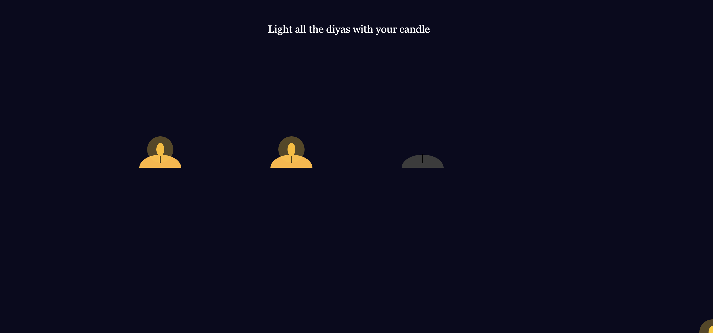
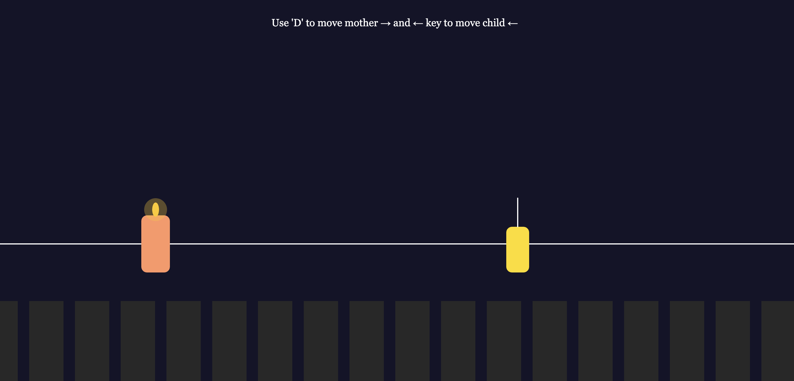
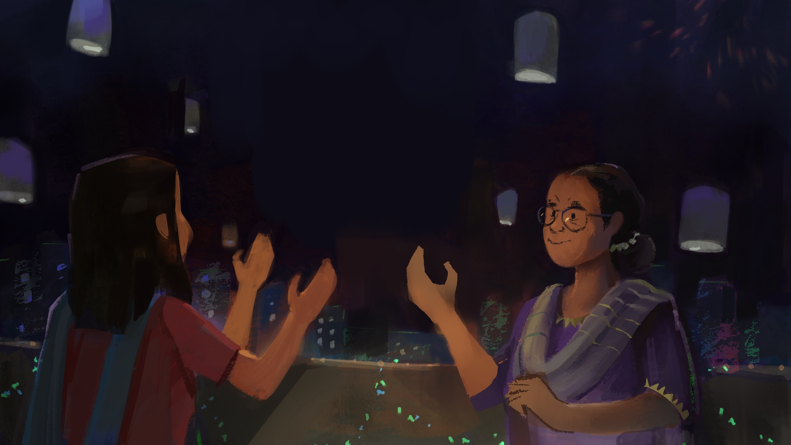
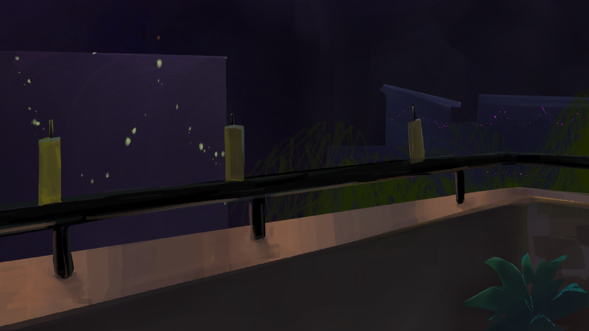
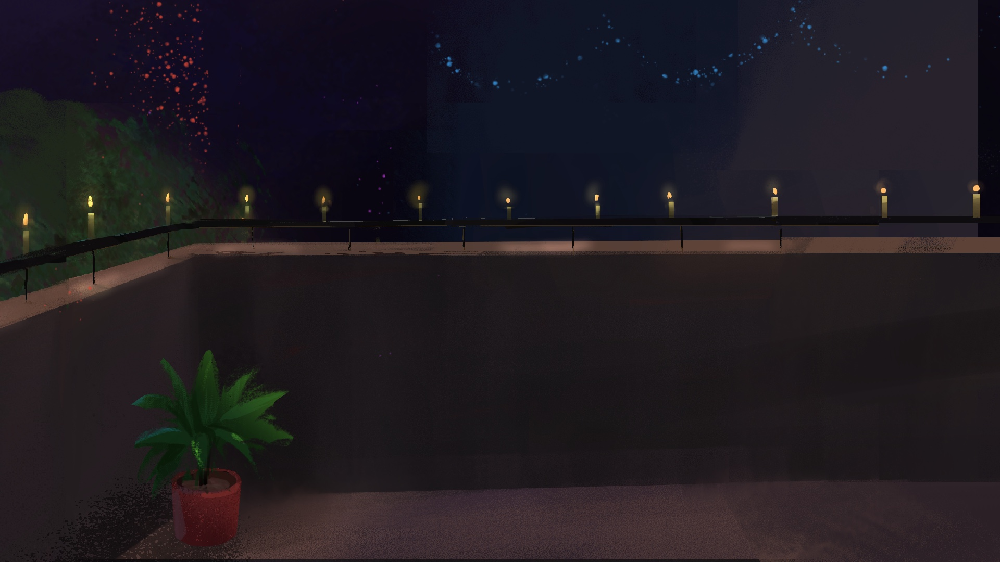
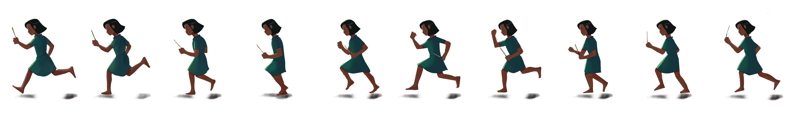
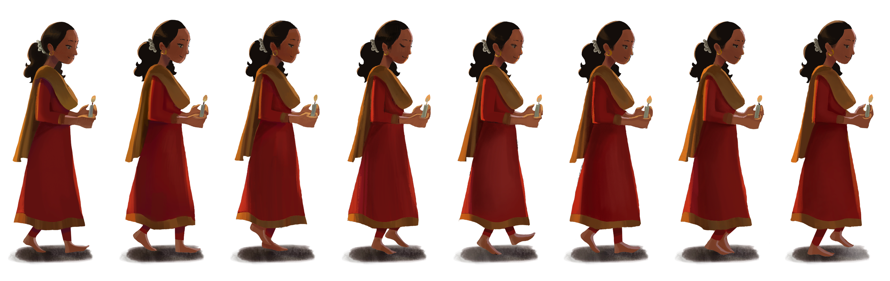
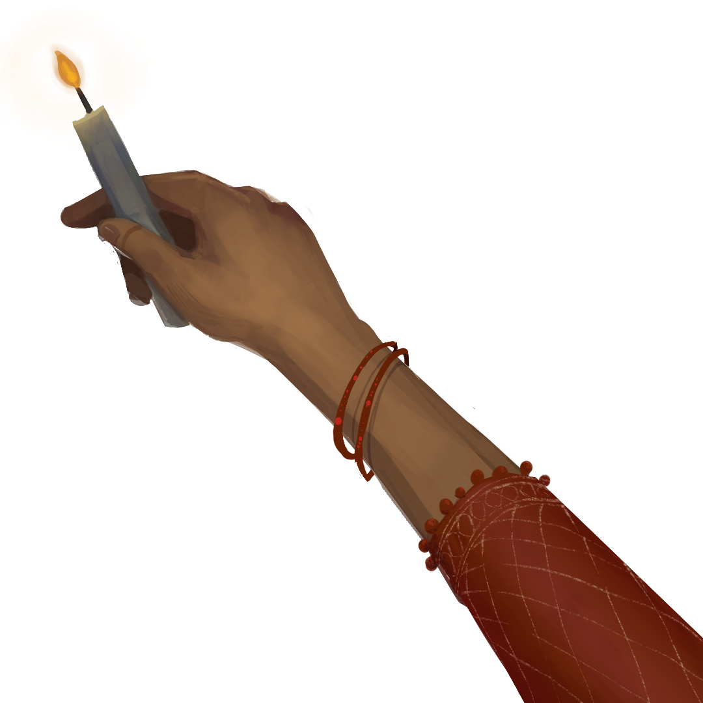

# Title: "Time Flies By"

## Narrative:
The inspiration for this project came from a recent personal experience. During a visit to my hometown for Diwali, I observed my mother, who continues to work tirelessly for our family even as she has gotten older. This sparked a realization about the passage of time. It made me reflect on my own need to become more mature and supportive, so she can finally rest and be cared for.

### Concept:
 I wanted to structure the narrative around two contrasting timelines:

The Past: This timeline shows my perspective as a young, carefree child, often causing trouble, while my mother happily provided for us, shielding me from her own challenges.

The Present: This timeline reflects my current viewpoint as a young adult. I am now able to see and understand the sacrifices and unspoken difficulties my mother experienced, which I was unable to recognize back then.

#### Scenes:

SCENE 0: The Intro Screen
- This is the title screen. It has the title "Time Flies By..." and "Click to begin" texts to begin the story.

SCENE 1:  Lighting the lantern
- It is present time, mother and daughter appears on the scene. They are lighting the lanterns.
This text  "Every Diwali feels the same —lamps, laughter, and light. But this year, something in the air felt slower… like time had been whispering all along." appears at the bottom. This scene represents a moment of quiet observation. The user interacts by lifting and releasing a lantern.

SCENE 2: Lighting the Candles
- The daughter is observing that her mother has aged as the  mother is lighting the candles alone. The text "Her hands tremble slightly as she lights the lantern. I see the years in her eyes" appears. The user has to light candles. And then the scene transitions.

SCENE 3: Mother and Daughter Meet
- The time shifts to past when mother and daughter both were young. Daughter was so carefree, unaware of any responsibilites. The text appears "The same eyes that once watched me chase sparks. I used to be her reason to hurry."  The user controls both the mother and daughter, bringing them together. When they meet, sparkles fly, symbolizing a moment of shared joy and connection.

SCENE 4: The Final Scene (Phuljhari)
- The story concludes with the daughter's final thought: "Now, I must learn to slow down for her." This completes the narrative arc. The user can now create "phuljhari" (sparkler) effects with their mouse, ending the story on an interactive and reflective note.

##### Prototype:

I approached game poem by adding scenes one by one. I used simple shapes such as rectangle, ellipse, etc for characters instead of images first. Next I replaced the shapes with illustrations I made.

Following is the code logic I used for this poem:

1. For intro scene, I drew the background image and centered text for the title.
2. For scene 1, I created a lantern object with x, y, dragging, and released properties. In draw(), I added an if (lantern.released) check to make lantern.y decrease, so it floats up. I added fade out transition for each scene.
3. For scene 2, I added hand image on mouseX, mouseY position.Then, I added elliptical flickering flames, when clicke, to light three candles.
4. For scene 3, sliced the sprite sheets into motherFrames and daughterFrames arrays. Used keyPressed() to set moveRight and daughterMoveLeft to true when keys "D" and "Left Arrow" are pressed, respectively. Added a condition when they meet at middle of the canvas their movement stops. Finally, sparkle animation appears and the scene transitions to scene 4. For sparkle , I created another object.
5. For scene 4, I continuously added new phuljhariParticles at mouseX and mouseY to create a sparkler effect. I used scene4TextTimer to create a 2-second delay before the final text faded in.
6. For end Scene, after the text appeared, endSceneTimer starts. After 3 seconds, it set endScene = true, fading the screen to black.
7. In mousePressed(),  if the scene had ended, a click resets all game variables back to their starting values. This restarts the game poem.
8. I added sound at the very in setup.

Images of Prototype:

Images of Illustrations used:

