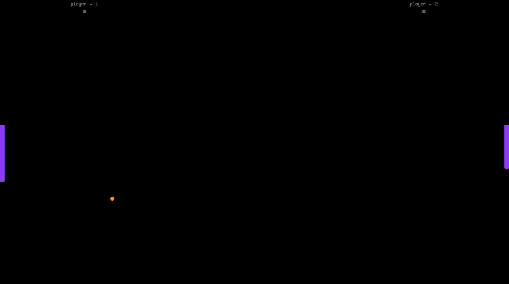
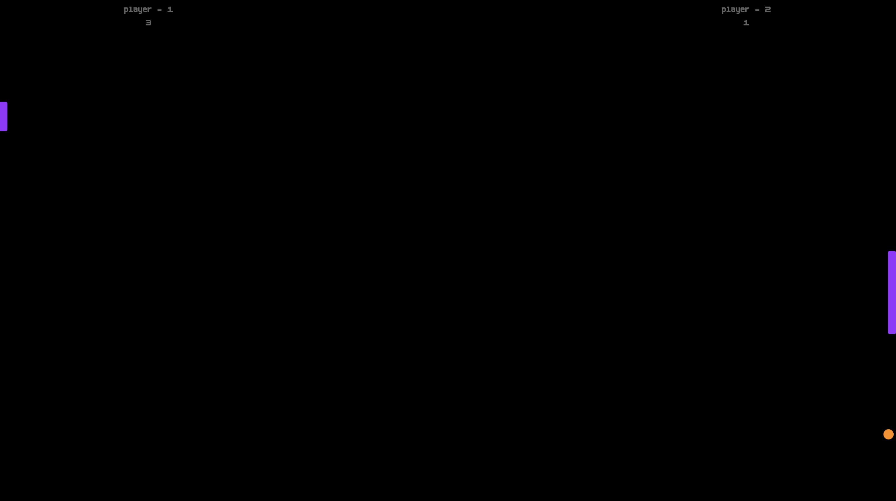
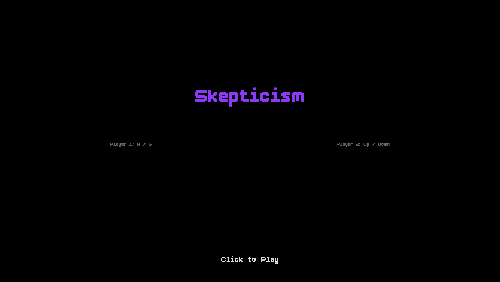
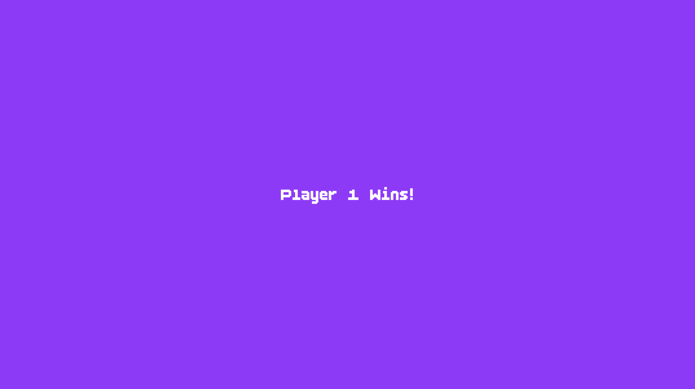

# **Assignment 01: Recontextualizing Pong**

Chosen "Ism": Skepticism - "doctrine that true knowledge is always uncertain"

 # What is Skepticism?

Skepticism, also spelled scepticism, refers to a doubting attitude towards knowledge claims. It is an expression of doubting or questioning that is applied to any topic, such as politics, religion. For example, if one is skeptical of their favorite hockey team whether they will win or not,they are uncertain about the strength of their performance.vSkeptics believe that what we perceive may be deceptive or incomplete — that truth might exist, but we can never be entirely sure we’ve found it. Translating this into play means creating experiences that destabilize the player’s expectations, making them second-guess their understanding of how the game works.

##  Personal Interpretation of "Skepticism":

 Skepticism is the fundamental doubt in one's ability to know truth.  A skeptical game is one that makes the player doubt the reliability of the game system. The player is forced to question whether their inputs have a consistent, or predictable output. The player cannot trust their senses or their tools.

### Modified Rules of "Pong of Skeptiscism"

 Paddles: 

 - paddle's movement speed is not constant. Each frame, it moves a random distance within a range.
 - the height of both paddles randomly changes during gameplay.

 
 

 Ball:
 - it bounces off in random direction.
 - the ball size also changes

 Collision: 
 - hitting the top/bottom walls or the paddle results in a chaotic, unpredictable bounce. 
 - ball's vertical speed is completely randomized on every paddle hit.

 In classic Pong, the player builds certainty: "If I hit the ball here, it will go there. In this game, the unpredictable paddle movement makes the player doubt their own control.

####  Prototyping:

- it's a 2 - player game.
- the game uses a Ball class and a Paddle class to manage its objects.
- paddle speed, paddle size, ball size, and collision physics are randomised using the random() function 

##### Gameplay: 

- the prototype includes a "start" screen with the title and controls, a "play" state, and a "game over" state that displays the winner once a player reaches 7 points.

 
 